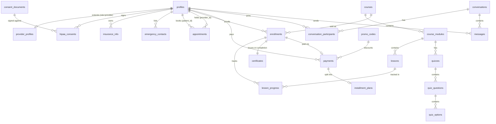

# Database Schema

Source of truth: `supabase/migrations/*.sql` (14 files, applied in order). This document is a
guided tour, not a duplicate of the SQL — read the migration file for any table's exact columns,
constraints, and comments.

## Migration order

| # | File | Contents |
|---|---|---|
| 1 | `extensions_and_enums.sql` | `pgcrypto`, `citext`, every enum type, the shared `set_updated_at()` trigger fn |
| 2 | `profiles.sql` | `profiles`, `provider_profiles`, the `handle_new_auth_user` signup trigger |
| 3 | `hipaa_consents.sql` | `consent_documents`, `hipaa_consents`, `has_pending_consent()` |
| 4 | `insurance_emergency_contacts.sql` | `insurance_info`, `emergency_contacts`, `patient_payment_methods` |
| 5 | `appointments.sql` | `availability_slots`, `appointments`, `appointment_reminders` |
| 6 | `messaging.sql` | `conversations`, `conversation_participants`, `messages` |
| 7 | `courses_lms.sql` | `courses`, `course_modules`, `lessons`, `quizzes` + questions/options/attempts |
| 8 | `enrollments_progress_certificates.sql` | `enrollments`, `lesson_progress`, `certificates` |
| 9 | `payments_promo_codes.sql` | `payments`, `promo_codes`, `installment_plans` |
| 10 | `permissions_rbac.sql` | `permissions`, `role_permissions`, `user_permission_overrides`, `effective_permissions` view |
| 11 | `notifications_audit_log.sql` | `notifications`, `audit_log` |
| 12 | `rls_policies.sql` | Every RLS policy, applied to every table |
| 13 | `functions_triggers.sql` | Drip-unlock, enrollment completion, certificate numbering |
| 14 | `seed_permissions.sql` | Default `permissions` rows + `role_permissions` grants |

## Entity relationship diagram



## Table-by-table notes

### Identity & access

- **`profiles`** — one row per `auth.users` account, created automatically by the
  `handle_new_auth_user` trigger. `role` is the base RBAC dimension. Self-signup can only produce
  `patient` or `student`; elevating to `provider`/`staff`/`admin` requires an existing admin
  (`PATCH /api/admin/users/[id]`, itself gated by the `profiles_admin_manage` RLS policy).
- **`provider_profiles`** — public-facing bio/credentials, separate from `profiles` so the
  marketing site can show "meet the team" without a public policy on the main identity table.
- **`permissions` / `role_permissions` / `user_permission_overrides`** — the fine-grained grant
  system layered on top of `role`. `effective_permissions` (a view, not a table) flattens
  `role_permissions[role]` overridden per-user by `user_permission_overrides` into a single
  `(user_id, permission_key)` truth table that both RLS policies and `hasPermission()` read.

### HIPAA compliance

- **`consent_documents`** — versioned legal text; only one `is_current = true` row per
  `document_type` at a time (partial unique index).
- **`hipaa_consents`** — append-only signature log. Snapshots the exact text signed
  (`body_md_snapshot`), not just a pointer to the document, so an audit reviewer sees precisely
  what the user agreed to even if the template is edited later. `revoked_at` is the only mutable
  column.
- **`audit_log`** — append-only (`revoke update, delete on audit_log from public`), written by
  `src/lib/audit.ts#logAudit()` from Route Handlers any time PHI-adjacent data is created, viewed
  in bulk, updated, or exported.

### Clinical operations

- **`appointments`** — `provider_notes_encrypted` is `bytea`, AES-256-GCM encrypted; everything
  else on the row is queryable in plaintext for scheduling logic.
- **`availability_slots`** — provider-authored calendar; `is_blocked` rows are never offered for
  patient booking (`availability_public_read` policy filters them out) but remain visible to the
  provider for their own planning.
- **`insurance_info` / `emergency_contacts` / `patient_payment_methods`** — patient-owned PHI.
  Insurance fields are `bytea`-encrypted; payment methods store only a Stripe Customer/PaymentMethod
  pointer, never card data.

### LMS / academy

- **`courses` → `course_modules` → `lessons`** — the catalog hierarchy. `courses.drip_interval_days`
  is the *default* cadence; a module can override it with its own `drip_day_offset`.
- **`enrollments`** — one row per (student, course). `drip_anchor_at` freezes the drip schedule's
  start date at enrollment time, so changing a course's `drip_interval_days` later doesn't retroactively
  shift already-enrolled students.
- **`lesson_progress`** — seeded entirely by the `enrollments_initialize_progress` trigger at
  enrollment time (one row per lesson, `locked` or `available` depending on day 0 offset), then
  advanced by `unlock_due_lessons()` (scheduled) and the lesson-complete API route.
- **`certificates`** — one per enrollment (`unique` constraint), auto-issued by
  `maybe_complete_enrollment()` once every `lesson_progress` row for that enrollment is
  `completed`. `mentorship_expires_at` is `issued_at + courses.mentorship_months`, which is what
  gates access to `/student/mentorship`.

### Commerce

- **`payments`** — one row per checkout attempt, created `pending` before redirecting to Stripe
  and flipped to `succeeded`/`failed` exclusively by the webhook handler (never by client code).
- **`promo_codes`** — no public/anon select policy on purpose (codes aren't enumerable by
  browsing the table); validated server-side in `/api/checkout` and redeemed atomically via the
  `increment_promo_redemption()` function to avoid a race on `times_redeemed`.
- **`installment_plans`** — tracks a Stripe subscription standing in for "pay over N months";
  the webhook cancels the subscription once `installments_paid` reaches `installment_count`.

## Row Level Security posture

Every table has `alter table ... enable row level security` plus explicit policies — there is no
table left open to "authenticated" by omission. The general pattern:

- **Own-row access**: `patient_id = auth.uid()` / `student_id = auth.uid()` / etc.
- **Staff/provider access**: gated by `has_permission('<key>')`, not just `role`, so an admin can
  extend or restrict a specific staff member's reach without a schema change.
- **Admin override**: `is_admin()` grants full access on every table as a `for all` policy.
- **Public/marketing reads**: only on genuinely public data — published courses, preview lessons,
  provider bios, current consent document text.

Four `security definer` helper functions (`current_role_name()`, `is_staff_or_above()`,
`is_admin()`, `has_permission()`, plus `is_conversation_participant()` and
`is_enrolled_in_course()`) keep policy definitions short and consistent; see the top of
`00000000000012_rls_policies.sql`.

## Regenerating TypeScript types

`src/types/database.ts` is hand-maintained today. Once a live Supabase project exists:

```bash
supabase gen types typescript --project-id <ref> > src/types/database.generated.ts
```

and reconcile the two — see `docs/ROADMAP.md` phase 1.
